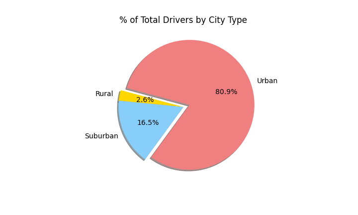

# Pyber_Analysis

## Overview of the analysis

With this analysis we will be creating a summary Data Frame of the ride-sharing data by city type comparing quantity and fares of rides divided in three categories:
    * Urban
    * Suburban 
    * Rural 
This analysis will provide a recommendation to the PyBer CEO for making better decisions.

## Results 

By doing the merge of all the information given and creating some graphics to vizualize better you can see in the pie charts below that the type of city with more Fares and Rides is the Urban cities and it is the same with the total Drivers obtaining for Urban cities 80.9% meanwhile Suburban has 16.5% and Rural 2.6%. Also in the analysis is clear that in the Rural cities the cost for the rides is more expensive than the other two categories. 

In the next line chart you can see the total fare by city type between January and May of 2019. All the three categories maintain a positive tendency having a little increase in late February. As you can see in the rural cities the fare is the lowest and this could be due to the low total of drivers and the expensive cost. 

